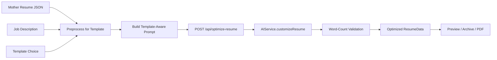
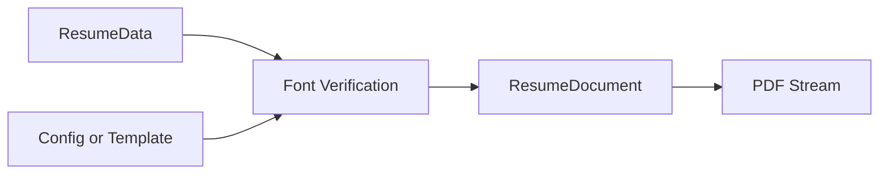

# Dynamic Resume – AI-Powered Resume Optimization

**Version 0.1.0** – A streamlined Next.js application that generates **AI-optimized, ATS-friendly PDF resumes** with template-aware content adaptation based on job descriptions.

This document is the **single source of truth** for the current codebase state, features, technology, workflows, and capabilities. Use it as the tech team status report and as the foundation for future improvement plans (e.g. improving the logic of creating the optimized resume from the mother resume while keeping the current stack).

---

## Status Report Summary

Dynamic Resume provides a one-page optimization hub: paste a job description, choose a template (2- or 3-page), and get an AI-tailored resume with real-time preview, archive, and PDF download. The stack is Next.js 15 (App Router), React 19, TypeScript, Tailwind CSS 3, and `@react-pdf/renderer` for PDFs. AI is integrated via `fetch` to OpenAI, Anthropic, Google AI, or Ollama (env-driven). Mother resume data lives in `data/resume.json`; the archive is stored in browser `localStorage`. Future work will focus on improving the optimization logic (mother → optimized resume) on this same stack.

---

## Key Features

- **One-Page Optimization Hub** – Streamlined interface: job description → template selection → AI optimization → save/download.
- **Template-Aware AI** – Optimization respects template constraints (page limits, word/item limits) via preprocessed data and structured prompts.
- **Job Description Analysis** – Paste or extract from URL; AI tailors content to the role.
- **Multiple Resume Templates** – Compact Professional (2 pages), Detailed Professional (3 pages), Technical Focus (2 pages), each with defined word and item limits.
- **Real-Time Preview** – Web preview updates as you optimize; PDF uses the same data.
- **ATS-Friendly PDF** – `@react-pdf/renderer` with Lato fonts for consistent, parseable PDFs.
- **Resume Archive** – Save and load versions in localStorage; download as PDF or JSON.
- **Customize Page** – URL extraction, prompt templates (general, technical, marketing, etc.), and custom AI prompt (stored in Settings).
- **Rule-Based PDF Variants** – GET `?type=marketing|technical|data-analysis|management` for non-AI role-focused PDFs from mother data.

---

## Technology Stack

| Layer | Technology |
|-------|------------|
| Framework | Next.js 15 (App Router), React 19, TypeScript |
| Styling | Tailwind CSS **v3** (^3.4.0) |
| PDF | `@react-pdf/renderer` v4.3.0; fonts: Lato (Regular, Bold, Italic) from `public/fonts/` |
| AI | No SDK; `fetch` to provider APIs. Supported: **OpenAI**, **Anthropic**, **Google AI**, **Ollama** (see [src/services/aiService.ts](src/services/aiService.ts)) |
| Data | Mother resume: [data/resume.json](data/resume.json); archive: `localStorage` key `resumeArchive` |

---

## Deploy on Vercel (GitHub integration)

The app is built to run on **Vercel** without local setup:

1. **Connect repo** – In [Vercel](https://vercel.com), import your GitHub repository and deploy.
2. **Environment variables** – In the project: **Settings → Environment Variables**, add at least:
   - `OPENAI_API_KEY` (required for resume AI). Optionally `AI_PROVIDER`, `OPENAI_MODEL`.
   - For vector/RAG and match score: `PINECONE_API_KEY`, `PINECONE_INDEX`, `PINECONE_NAMESPACE` (see below).
3. **Test credentials** – After deploy, open **/admin**. Paste your OpenAI and/or Pinecone credentials and use **Test connection** to verify. The app does not store these; add the same values in Vercel env so the app can use them.
4. **Redeploy** – After changing environment variables, trigger a new deployment so the new values are applied.

No local run or `.env` file is required for production; configure everything in Vercel and test from the Admin page.

---

## Environment Variables

Copy [.env.example](.env.example) for reference. For Vercel, set these in **Project Settings → Environment Variables**:

| Variable | Required | Description |
|----------|----------|-------------|
| `AI_PROVIDER` | No (default: `openai`) | One of: `openai`, `anthropic`, `google`, `ollama` |
| `OPENAI_API_KEY` | Yes if OpenAI | OpenAI API key (test via /admin) |
| `OPENAI_MODEL` | No | Default: `gpt-4o-mini` |
| `ANTHROPIC_API_KEY` | Yes if Anthropic | Anthropic API key |
| `ANTHROPIC_MODEL` | No | Default: `claude-3-haiku-20240307` |
| `GOOGLE_AI_API_KEY` | Yes if Google | Google AI API key |
| `GOOGLE_AI_MODEL` | No | Default: `gemini-1.5-flash` |
| `OLLAMA_BASE_URL` | No | Default: `http://localhost:11434` (not used on Vercel) |
| `OLLAMA_MODEL` | No | Default: `llama3.1:8b` |
| `PINECONE_API_KEY` | Optional | For RAG and match score (test via /admin) |
| `PINECONE_INDEX` | Optional | Pinecone index name (dimension 1536, cosine) |
| `PINECONE_NAMESPACE` | No | Default: `resume-chunks` |

---

## Application Structure and Routes

| Route | Purpose | Key Files |
|-------|---------|-----------|
| `/` | Main optimization hub: job description → template → AI optimize → preview, archive, PDF | [src/app/page.tsx](src/app/page.tsx), [src/utils/templateAwarePrompts.ts](src/utils/templateAwarePrompts.ts) |
| `/archive` | View saved versions; download PDF or JSON; set current | [src/app/archive/page.tsx](src/app/archive/page.tsx) |
| `/customize` | URL extraction, prompt templates, custom prompt; same AI backend | [src/app/customize/page.tsx](src/app/customize/page.tsx), [src/utils/promptTemplates.ts](src/utils/promptTemplates.ts) |
| `/settings` | Target page count (1–5), custom AI prompt, clear archive | [src/app/settings/page.tsx](src/app/settings/page.tsx) |
| `/admin` | Add and test OpenAI & Pinecone credentials; Vercel env setup instructions | [src/app/admin/page.tsx](src/app/admin/page.tsx) |
| `/mother-resume` | Edit mother resume: add/remove items (summary, competencies, experience, education, certifications); save to API | [src/app/mother-resume/page.tsx](src/app/mother-resume/page.tsx), [src/app/api/resume/route.ts](src/app/api/resume/route.ts) |

---

## Architecture and Data Flow

### Main optimization flow (home hub)



### PDF generation



### Customize flow

URL (optional) → `POST /api/extract-url` → job text; then prompt template + optional custom prompt → `generateAICustomizedResume` → `POST /api/optimize-resume` (returns **202** + `jobId`) → client polls `GET /api/optimize-resume/status?jobId=...` → same backend.

### Mother resume API

- **GET /api/resume** – Returns current mother resume (in-memory override if set, else `data/resume.json`).
- **POST /api/resume** – Saves mother resume (in-memory). For local file persistence, set `ALLOW_RESUME_FILE_WRITE=1` so the server writes to `data/resume.json` (not available on Vercel).

---

## Template System

Templates are defined in [src/types/template.ts](src/types/template.ts):

| Template | Max Pages | Summary (words) | Experience/job (words) | Core competencies (items) |
|----------|-----------|-----------------|-------------------------|----------------------------|
| Compact Professional | 2 | 100 | 120 | 8 |
| Detailed Professional | 3 | 130 | 180 | 10 |
| Technical Focus | 2 | 90 | 100 | 6 |

- **Content fit:** `analyzeContentFit(resumeData, template)` returns violations and recommendations; the hub shows these in the UI.
- **Preprocessing:** `preprocessResumeForTemplate()` in [src/utils/templateAwarePrompts.ts](src/utils/templateAwarePrompts.ts) trims experience entries, competencies, certifications, and technical skills per template limits before sending to the AI.
- **Prompt building:** Template-specific instructions (word limits, item limits, emphasis) are injected into the prompt used for `/api/optimize-resume`.

---

## AI Integration

- **Providers:** OpenAI, Anthropic, Google AI, Ollama; selected via `AI_PROVIDER` and corresponding env vars in [src/services/aiService.ts](src/services/aiService.ts).
- **Main hub:** Prompt is built by `generateTemplateAwarePrompt()` and `createFinalPrompt()` in [src/utils/templateAwarePrompts.ts](src/utils/templateAwarePrompts.ts); optional override from `localStorage.customAIPrompt` (Settings).
- **Customize:** Uses [src/utils/promptTemplates.ts](src/utils/promptTemplates.ts) (general, technical, marketing, management, sales, creative) or custom prompt; calls same `/api/optimize-resume`.
- **Word-count enforcement:** [src/services/aiService.ts](src/services/aiService.ts) adds word-count constraints to the prompt and validates the AI response; rejects if summary or experience sections exceed limits.
- **Dynamic vs static:** Only fields with `_dynamic: true` (and experience `_dynamic_company`, `_dynamic_title`, etc.) are intended to be modified by the AI; response must preserve the same JSON structure.

---

## API Reference

### POST `/api/optimize-resume`

- **Body:** `{ prompt: string, jobDescription: string, resumeData: ResumeData }`
- **Returns:** `{ success: boolean, data: ResumeData }`
- **Behavior:** Creates `AIService` from env, calls `customizeResume(jobDescription, resumeData, prompt)`, validates word counts, returns optimized data.

### POST `/api/generate-pdf`

- **Body:** `{ resumeData, config?, template?, jobDescription?, filename? }`
- **Returns:** PDF stream (attachment).
- **Behavior:** Verifies fonts via [src/utils/fontManager.ts](src/utils/fontManager.ts). If `template` is provided and `config` is not, config is derived from template. Renders with [ResumeDocument](src/components/ResumeDocument.tsx).

### GET `/api/generate-pdf?type=...`

- **Query:** `type` = `marketing` | `technical` | `data-analysis` | `management` | `default`
- **Returns:** PDF stream (attachment).
- **Behavior:** Uses [src/utils/resumeGenerator.ts](src/utils/resumeGenerator.ts) to build role-focused resume from mother data (no AI), then generates PDF.

### POST `/api/extract-url`

- **Body:** `{ url: string }`
- **Returns:** `{ success, content?, error?, metadata? }`
- **Behavior:** Validates URL; blocks private/localhost; fetches HTML (10s timeout, 1MB max); returns raw HTML content.

---

## Resume Data Model

- **Schema:** [src/types/resume.ts](src/types/resume.ts) – `ResumeData`: `header`, `summary`, `coreCompetencies`, `technicalProficiency` (programming, cloudData, analytics, mlAi, productivity, marketingAds), `professionalExperience[]`, `education`, `certifications`.
- **Dynamic flags:** Each section/field can have `_dynamic: boolean`; experience entries also have `_dynamic_company`, `_dynamic_title`, `_dynamic_dateRange`, and `description._dynamic`. Only `_dynamic: true` content is optimized by the AI.
- **Edit mother resume:** Update [data/resume.json](data/resume.json) and set `_dynamic` as desired.

---

## Archive Storage

- **Key:** `localStorage.resumeArchive` (JSON array).
- **From home hub:** Entries look like `{ id, label, data, template, jobDescription, createdAt }`. PDF API can derive config from `template`.
- **From customize:** Entries may have `{ label, data, config, isCurrent, date }`. Archive page displays `date`; for items saved from the hub, `createdAt` is used and may be shown as date if the archive page normalizes (e.g. `item.date ?? item.createdAt`). Document both shapes for compatibility when building features.

---

## Known Issues and Fixes

### Core Competencies horizontal scroll (fixed)

- **Issue:** The Core Competencies section in the web preview used `whitespace-nowrap overflow-x-auto` on list item spans, causing horizontal scroll.
- **Fix (applied):** In [src/components/Resume.tsx](src/components/Resume.tsx), the span was changed to `break-words` and `maxWidth: '100%'` so text wraps and does not overflow. Optional global fallback if needed elsewhere:

```css
main { overflow-x: hidden; max-width: 100%; }
section ul li span {
  white-space: normal !important;
  overflow-x: visible !important;
  word-wrap: break-word;
  overflow-wrap: break-word;
}
```

### Static PDF file serving

To serve a static PDF (e.g. a pre-generated CV):

1. Place the file in `public/`, e.g. `public/CV-Meysam-Soheilipour.pdf`.
2. It is then available at `https://<your-domain>/CV-Meysam-Soheilipour.pdf`.
3. Optional: use Next.js rewrites in `next.config.ts` or an API route if you need a custom path or headers.

---

## Codebase Map

| Path | Role |
|------|------|
| [src/types/resume.ts](src/types/resume.ts) | ResumeData, ResumeConfig |
| [src/types/template.ts](src/types/template.ts) | Templates, constraints, analyzeContentFit |
| [src/services/aiService.ts](src/services/aiService.ts) | AI providers, createAIService, customizeResume |
| [src/utils/templateAwarePrompts.ts](src/utils/templateAwarePrompts.ts) | Preprocess, template-aware prompt building |
| [src/utils/aiResumeGenerator.ts](src/utils/aiResumeGenerator.ts) | callAIService, generateAICustomizedResume (customize flow) |
| [src/utils/resumeGenerator.ts](src/utils/resumeGenerator.ts) | Rule-based marketing/technical/data/management variants |
| [src/utils/wordCountUtils.ts](src/utils/wordCountUtils.ts) | Word counts, truncation, stats |
| [src/utils/promptTemplates.ts](src/utils/promptTemplates.ts) | Prompt templates for customize page |
| [src/utils/errorHandler.ts](src/utils/errorHandler.ts) | Centralized error handling, useErrorHandler |
| [src/utils/fontManager.ts](src/utils/fontManager.ts) | Lato font registration and verification for PDF |
| [src/services/urlExtractor.ts](src/services/urlExtractor.ts) | URL extraction (used by API route) |
| [src/components/Resume.tsx](src/components/Resume.tsx) | Web resume preview |
| [src/components/ResumeDocument.tsx](src/components/ResumeDocument.tsx) | PDF document (@react-pdf/renderer) |

**Unused / alternate:** [src/utils/tailorResume.ts](src/utils/tailorResume.ts) (`tailorResumeForJD`) and [src/services/templateAwareAIService.ts](src/services/templateAwareAIService.ts) (`TemplateAwareAIService`, `optimizeResumeForTemplate`) are not used by the app routes; they remain available for server-side or batch template-aware flows if needed.

---

## Quick Start

```bash
git clone <repository-url>
cd dynamic-resume

npm install

# Set environment variables (see Environment Variables above)
# e.g. create .env.local with OPENAI_API_KEY=... and AI_PROVIDER=openai

npm run dev
```

Then open the app, paste a job description, select a template, and run optimization. Build for production: `npm run build` and `npm start`.

---

## Deployment

- **Platform:** Optimized for Vercel (and other serverless hosts).
- **CI/CD:** On push to `main`, [.github/workflows/deploy.yml](.github/workflows/deploy.yml) triggers a Vercel deploy via the `VERCEL_DEPLOY_HOOK_URL` secret.
- **Static PDF:** Place pre-built PDFs in `public/` to serve them at the root path.

---

## Future Enhancements

- Improve optimization logic (mother → optimized resume) while keeping the current stack.
- Multi-language support; industry-specific templates; LinkedIn import.
- A/B testing; analytics; team collaboration on resume versions.
- Integration with additional or newer LLM providers.

---

## Use Cases

- **Job seekers:** Adapt resume per application; highlight transferable skills; prioritize relevant experience.
- **Career coaches:** Support clients with role-specific resumes; use prompt templates and custom prompts.
- **Recruiters:** Help candidates tailor resumes to specific positions.

---

## License

MIT License.

---

## Contributing

Contributions are welcome. Use this README as the reference for current behavior and stack.

---

## Support

For questions about AI prompts, resume generation, or the codebase, open an issue.
